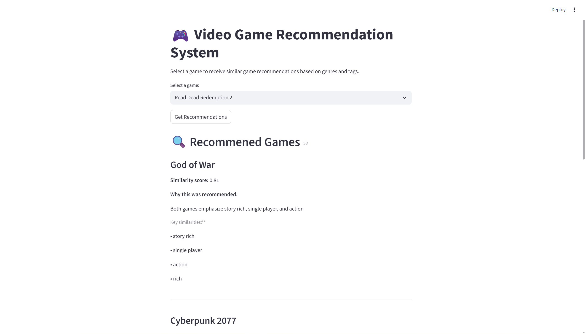

# 🎮 Video Game Recommendation System

An explainable content-based recommendation system that suggests similar video games based on shared genres and tags.

## 🔍 How It Works
- Combines game genres and tags into a single text representation
- Uses TF-IDF vectorization with cosine similarity
- Recommends games with the highest similarity scores
- Provides human-readable explanations for each recommendation

## 🛠️ Technologies Used
- Python
- pandas
- scikit-learn
- Streamlit

## 🚀 How to Run
```bash
pip install pandas scikit-learn streamlit
streamlit run app.py
```

## 📸 Example Output


## 🔮 Future Improvements
- Incorporate user ratings or reviews
- Explore semantic embeddings for richer similarity
